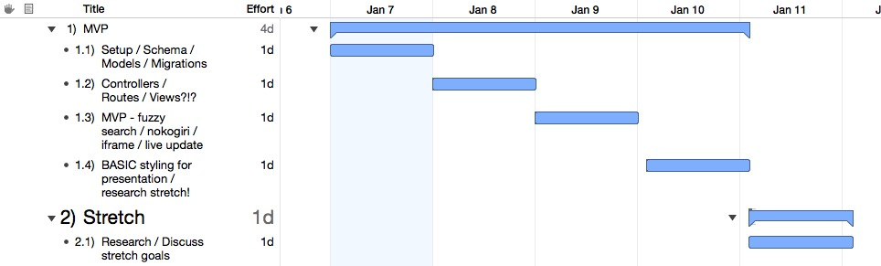
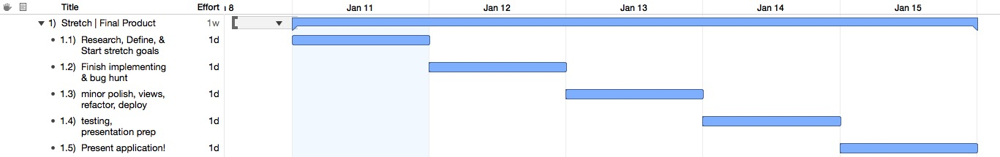
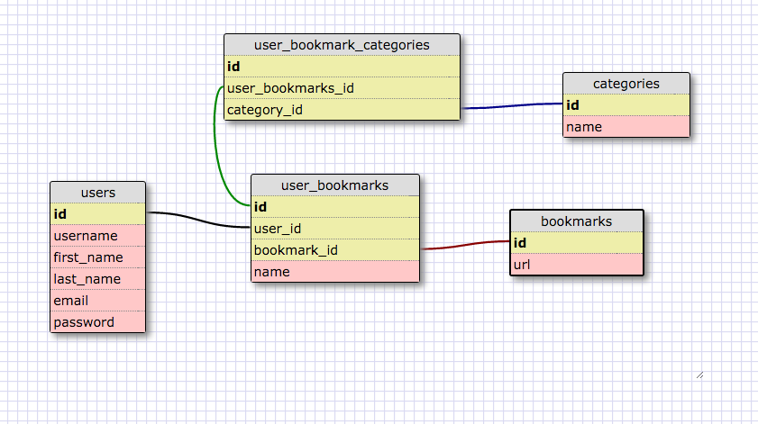
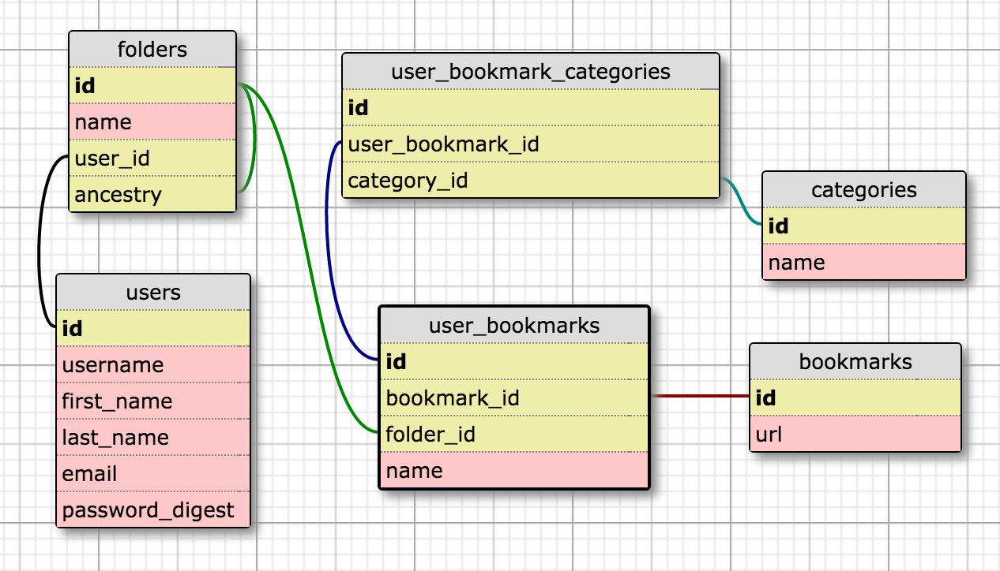

#SWISS

Swiss is a bookmark management application that allows users to import their bookmarks and add new ones through a companion browser extension. An ElasticSearch Java server allows for real time database querying by name, url, and any keywords or sentences featured within the content of the bookmarked page. From search results, users are able to render live previews of the webpage directly within the application. 

https://www.swissdbc.herokuapp.com

### Current technologies:

* Rails 4

* HTML5

* CSS3(Vanilla CSS(no framework utilized))

* JavaScript

* PostgreSQL

* Full markdown and syntax highlighting support(admin)

* File upload support

* ElasticSearch Java server(search blog/projects)

* Deployed on Heroku

### Team Members
Chris Savage

Chris Lee

James Kirkpatrick

Bruno Zatta

### Timeline MVP

### Timeline Stretch

### Trello

<a href="https://trello.com/b/SEOKS4kQ/swiss">SWISS</a>

### Schema Design 1

### Schema Update

